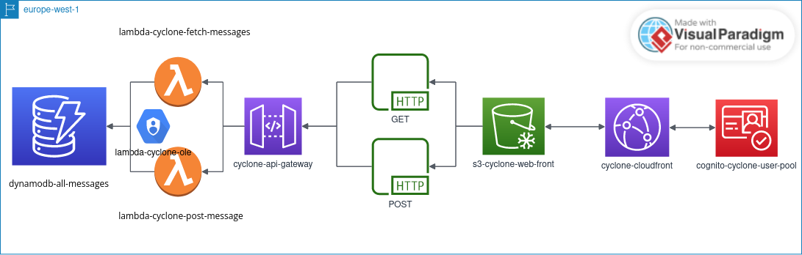

# CLOUD_DEVOPS_AWS

## Description du Projet
Ce projet contient le code source et la configuration nécessaire pour déployer une application de type livre d'or (guest book) sur AWS.

### Structure du Projet
- **Frontend:** Le code source du front se trouve dans le dossier `./website`.
- **Lambdas:** Les fonctions Lambda sont implémentées dans les fichiers `fetch_messages.py` et `get_message.py`.
- **Terraform:** Le code Terraform, utilisé pour créer et gérer la quasi-totalité des ressources AWS, se trouve à la racine du projet.
- **Scripts Bash:** Divers scripts Bash sont inclus pour des tâches comme la création d'utilisateurs et la récupération de tokens.

Voici un chiffrage concernant ce projet [Chiffrage](./chiffrage.md).
